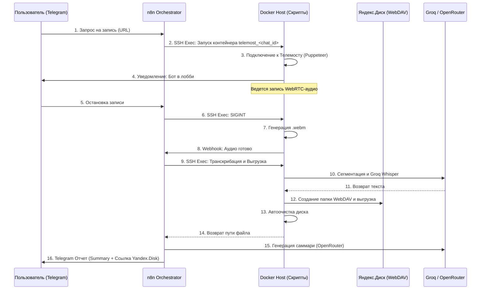

# Telemost Recorder repository snapshot — v04 / 2026-08-03

Repository: https://github.com/3dstepansky/stepansky-telemost-recorder-doker
Local analysis path: /tmp/telemost-repo
Analysis date: 2026-08-03

## Branches / recency

```text
v04 2026-07-03 02:40:43 +0300 508deeb feat: direct telegram delivery and ai summary fix
origin/v04 2026-07-03 02:40:43 +0300 508deeb feat: direct telegram delivery and ai summary fix
master 2026-05-31 00:10:31 +0300 b563afd docs: rewrite README based on v1 spec
origin/003v 2026-05-31 00:10:31 +0300 b563afd docs: rewrite README based on v1 spec
origin 2026-05-31 00:10:31 +0300 b563afd docs: rewrite README based on v1 spec
origin/master 2026-05-31 00:10:31 +0300 b563afd docs: rewrite README based on v1 spec
origin/test 2026-04-13 01:57:12 +0300 7cfee56 feat: stabilize process lifecycle and fixing n8n reporting
```

Conclusion: актуальная ветка по дате коммита — `origin/v04` (`508deeb`, 2026-07-03). `master`/`003v` старее (`b563afd`, 2026-05-31) и описывает устаревшую n8n-архитектуру.

## Recent commit history

```text
508deeb 2026-07-03  (HEAD -> v04, origin/v04) feat: direct telegram delivery and ai summary fix
6c7e5ef 2026-06-20  fix: replace ForceReply in SendRecordMenu with ReplyKeyboard Back button to improve UX
3913c8f 2026-06-20  feat: implement telegram-ui-designer skill in project folder
0483de1 2026-06-20  feat: implement n8n capability skills in project folder
3330b58 2026-06-20  feat: redesign Telegram Bot interface to professional HTML format
a3edf17 2026-06-20  Add n8n_workflow_v0.4.json matching release v0.4
150eb2e 2026-06-20  Update database.sql to match n8n table names (telemost_*)
55bc081 2026-06-20  Release v0.4: Multi-recording, custom bot names, and stability fixes
b563afd 2026-05-31  (origin/master, origin/HEAD, origin/003v, master) docs: rewrite README based on v1 spec
9d68736 2026-05-31  fix(recorder): strip brackets and quotes from BOT_DISPLAY_NAME
4afae3c 2026-05-30  fix directory permissions
92f173e 2026-05-30  Refactor: Split transcription pipeline into upload_audio and transcribe phases
735e902 2026-05-30  fix: use docker run for --create to prevent zombie processes on host
e2f1c34 2026-05-30  fix: remove duplicate node run.js from run_join.sh arguments
6a1f8fb 2026-05-30  fix: change base image to official node:20-slim to fix ARM64 build
a8c2334 2026-05-30  fix: add --init flag to docker run to prevent zombie processes
0484d9c 2026-05-30  docs: rewrite README using specs and quickstart
348ad0d 2026-05-30  chore: add spec to README, ignore .inv, remove secret from local_bridge
7cfee56 2026-04-13  (origin/test) feat: stabilize process lifecycle and fixing n8n reporting
eb686e3 2026-04-13  v0.003 FINAL: Impeccable integration with n8n webhooks and shell scripts
5bfb842 2026-04-13  v0.003: Impeccable integration, Graceful Shutdown, and n8n scripts integration
e5165ff 2026-04-12  v0.002: Autonomous VAD, Segmentation and AI Transcription pipeline
7985161 2026-04-12  release: v0.001 MVP Docker Recorder with clean naming
```

## File tree (depth ≤ 3)

```text
.dockerignore
.env.example
.github/agents/speckit.agent-context.update.agent.md
.github/agents/speckit.analyze.agent.md
.github/agents/speckit.checklist.agent.md
.github/agents/speckit.clarify.agent.md
.github/agents/speckit.constitution.agent.md
.github/agents/speckit.implement.agent.md
.github/agents/speckit.plan.agent.md
.github/agents/speckit.specify.agent.md
.github/agents/speckit.tasks.agent.md
.github/agents/speckit.taskstoissues.agent.md
.github/copilot-instructions.md
.github/prompts/speckit.agent-context.update.prompt.md
.github/prompts/speckit.analyze.prompt.md
.github/prompts/speckit.checklist.prompt.md
.github/prompts/speckit.clarify.prompt.md
.github/prompts/speckit.constitution.prompt.md
.github/prompts/speckit.implement.prompt.md
.github/prompts/speckit.plan.prompt.md
.github/prompts/speckit.specify.prompt.md
.github/prompts/speckit.tasks.prompt.md
.github/prompts/speckit.taskstoissues.prompt.md
.gitignore
.specify/extensions/.registry
.specify/extensions.yml
.specify/feature.json
.specify/init-options.json
.specify/integration.json
.specify/integrations/copilot.manifest.json
.specify/integrations/speckit.manifest.json
.specify/memory/constitution.md
.specify/templates/checklist-template.md
.specify/templates/constitution-template.md
.specify/templates/plan-template.md
.specify/templates/spec-template.md
.specify/templates/tasks-template.md
.specify/workflows/workflow-registry.json
Dockerfile
Dockerfile.test
MULTICHANNEL_HYPOTHESIS_ROADMAP.md
README.md
ROADMAP.md
STABILIZATION_REPORT.md
bot.js
database.sql
db.js
desktop.ini
docker-compose.yml
docker_spec.md
local_bridge.js
mock_n8n.py
n8n_workflow_head.json
n8n_workflow_v0.4.json
package-lock.json
package.json
recorder.js
run.js
run_join.sh
run_start.sh
run_stop.sh
run_transcribe.sh
run_upload.sh
services/ai.js
services/ffmpeg.js
services/s3.js
services/summarize.js
services/transcribe.js
services/webdav.js
set_recorder_display_name.sh
specs/002-standalone-bot-and-fixes/spec.md
specs/003-speaker-names-and-ai-summary/spec.md
test/db.test.js
transcribe.js
upload_audio.js
verify_rename_and_summarize_mock.js
```

## package.json

```json
{
  "name": "stepansky-telemost",
  "version": "0.003",
  "private": true,
  "type": "module",
  "description": "Zero Cost Yandex.Telemost Recorder (Guest Mode)",
  "main": "run.js",
  "scripts": {
    "start": "node bot.js",
    "record": "node recorder.js",
    "transcribe": "node transcribe.js",
    "track-probe": "node scratch/test_webrtc_tracks.js",
    "test": "node --test"
  },
  "dependencies": {
    "@aws-sdk/client-s3": "^3.500.0",
    "assemblyai": "^4.35.0",
    "axios": "^1.6.7",
    "dotenv": "^16.4.5",
    "form-data": "^4.0.6",
    "groq-sdk": "^1.2.1",
    "mkdirp": "^3.0.1",
    "puppeteer": "^24.0.0",
    "sqlite3": "^5.1.7",
    "telegraf": "^4.16.3"
  }
}
```

## Test result

```text
> stepansky-telemost@0.003 test
> node --test

# tests 3
# suites 1
# pass 3
# fail 0
# duration_ms 122.786924

Перед этим тест падал из-за отсутствия node_modules/sqlite3; после `npm install` тесты БД прошли. npm audit показал 16 vulnerabilities (2 low, 3 moderate, 10 high, 1 critical).
```

## README excerpt

```markdown
# Telemost Recorder Core (Zero-Cost Bot)


Автономный ИИ-ассистент для записи встреч Яндекс.Телемост с **нулевыми операционными затратами** (ZeroPay). Бот подключается к конференциям, перехватывает WebRTC-потоки, транскрибирует аудио, выгружает результаты на Яндекс.Диск и генерирует структурированные саммари встреч через интерфейс Telegram.

## 🚀 Философия и Ключевые особенности

1. **Headless WebRTC Injection**: Запись аудио осуществляется путем перехвата аудиопотоков из `RTCPeerConnection` непосредственно в изолированном Puppeteer-контейнере.
2. **Whisper-Friendly Chunking**: Интеллектуальное дробление аудиофайлов (FFmpeg) на чанки по 20 минут для обхода лимитов внешних API транскрибации (Groq Whisper 25 MB).
3. **Storage Self-Cleaning**: Гарантированное удаление локальных временных файлов и чанков с хоста после завершения работы.
4. **Интеграция с Яндекс.Диском (WebDAV)**: Полностью автоматическое сохранение медиафайлов и текстов в персональное облако пользователя (`Yandex.Telemost.Records/[Дата]_[Тема_от_ИИ]/`).
5. **Multi-User Isolation**: Запуск независимых, полностью изолированных Docker-контейнеров (`telemost_<chat_id>`) для поддержки одновременной записи нескольких встреч от разных пользователей.
6. **n8n Orchestration & FSM**: Управление всеми процессами, интерфейсами пользователя в Telegram и запросами в базу данных PostgreSQL инкапсулировано в воркфлоу n8n.

---

## 🆕 Что нового в релизе v0.4 (Текущая версия для тестирования)

В рамках релиза **v0.4** устранены архитектурные несоответствия и внедрена поддержка параллельной мульти-записи:
1. **Мульти-запись и защита от дубликатов**: Имена контейнеров теперь содержат уникальный ID встречи (`telemost_${CHAT_ID}_${MEETING_ID}`), что позволяет вести параллельные сессии записи. Повторный старт записи для той же встречи блокируется.
2. **Персональные имена ботов**: Бот подключается со своим отображаемым именем для каждого `chat_id` (настройка сохраняется в PostgreSQL в поле `bot_display_name` таблицы `user_settings`).
3. **Умный скрипт остановки**: [run_stop.sh](file:///E:/telemost/run_stop.sh) обновлен для точечной остановки встречи по `MEETING_ID` либо групповой остановки всех встреч по `CHAT_ID`.
4. **Устранение Race Condition**: Выгрузка в S3 теперь гарантированно происходит *до* вебхука n8n, чтобы локальный файл не удалился во время копирования.
5. **Ограничение контекста LLM**: Введено ограничение в 25 000 символов на текст транскрипции для суммаризатора в [services/summarize.js](file:///E:/telemost/services/summarize.js).

---

## 🗺 Архитектура системы

Система разделена на исполнительный слой (Docker-воркер на хост-сервере) и оркестрирующий слой (n8n).



---

## 📱 Telegram-интерфейс (UX)

Управление сервисом осуществляется через Telegram-бота, построенного как конечный автомат (FSM) с хранением состояний в PostgreSQL:

- **🔴 Запись встреч**: Режим ожидания ссылки (Force Reply). Бот автоматически подключается после получения ссылки.
- **🧠 Аналитика и ИИ**: Запуск ручной транскрибации, саммаризации или вывод списка последних 5 встреч (с ИИ-названиями).
- **⚙️ Настройки**: Настройка учетных данных Яндекс.Диска (логин + пароль приложения) прямо из мессенджера (без ручной конфигурации сервера).

---

## 📦 Развертывание и Настройка

### 1. Подготовка Сервера
Для хост-сервера необходимы: **Docker**, **Node.js (v20+)** и **FFmpeg**.
```bash
git clone https://github.com/3dstepansky/stepansky-telemost-recorder-doker.git
cd stepansky-telemost-recorder-doker
npm install
docker build -t stepansky-telemost-recorder:latest .
```

### 2. Конфигурация (.env)
Создайте `.env` файл на сервере:
```ini
# Отображаемое имя бота на встрече
BOT_DISPLAY_NAME="Бот-Ассистент"

# API Ключи
GROQ_API_KEY=gsk_...

# Лимиты
MAX_IDLE_MINS=3
MAX_DURATION_MINS=180
HEADLESS=true
```
*(Учетные данные Яндекс.Диска безопасно вводятся самими пользователями в интерфейсе Telegram).*

### 3. Настройка Оркестратора (n8n)
- Подключите Telegram-бота, SSH-ключ к вашему хост-серверу, базу данных PostgreSQL и OpenRouter (для саммари) через настройки Credentials в n8n.
- Импортируйте воркфлоу, чтобы активировать логику FSM и обработку вебхуков.

---

## 🎯 План Развития (Roadmap / v2)

- 🔴 **Diarization**: Разделение реплик по спикерам (замена базовой метки "Спикер").
- 🔴 **Real-Time AI Chat**: Интерфейс во время записи, позволяющий задавать вопросы боту по контексту обсуждаемого материала на лету.
- 🔴 **Archival Q&A**: Чат-сессия для ответов на вопросы по историческим (ранее записанным) встречам, загружаемым с Яндекс.Диска.
```

## Spec 002 excerpt / актуальная автономная архитектура

```markdown
# Спецификация требований: Telemost Recorder — Автономный Docker-бот

**Основная ветка**: `002-standalone-bot-and-fixes`  
**Предшествует**: `001-telemost-recorder-core` (n8n-архитектура, устарела — заменена на автономный бот)

**Дата создания**: 2026-06-20  
**Дата последнего обновления**: 2026-07-02

**Статус**: В разработке

> **Архитектурное решение**: Проект начался с оркестрацией через n8n + PostgreSQL. В июле 2026 принято решение отказаться от n8n. Вся логика управления ботом перенесена в автономный Node.js-процесс (`bot.js`) внутри Docker-контейнера с хранилищем SQLite.

---

## Статус реализации

| ID | История | Приоритет | Статус |
|---|---|---|---|
| US-1 | Запись WebRTC аудио (вход в комнату) | P1 | ✅ Реализовано |
| US-2 | Автоматическое завершение и Anti-Zombie | P1 | ✅ Реализовано |
| US-3 | Автономный Telegram-бот (замена n8n) | P1 | ✅ Реализовано |
| US-4 | Автовыход при завершении встречи организатором | P1 | ✅ Реализовано |
| US-5 | Информационный стиль Ильяхова | P2 | ✅ Реализовано |
| US-6 | Транскрибация с диаризацией (AssemblyAI + Groq fallback) | P2 | ⚠️ Пайплайн есть, диаризация не протестирована |
| US-7 | Выгрузка на Яндекс.Диск + S3 | P2 | ⚠️ Реализовано, требует проверки |
| US-8 | ИИ-саммари и рассылка в Telegram | P2 | ✅ Реализовано |
| US-9 | Быстрый старт по ссылке с inline-кнопкой | P1 | ✅ Реализовано |
| US-10 | Персональное имя бота в настройках | P2 | ✅ Реализовано (SQLite) |
| US-11 | ИИ-переименование папок на Яндекс.Диске | P2 | ⚠️ Частично (summarize.js) |
| US-12 | Интеграция с Яндекс.Календарём | P3 | ❌ Не начато |
| US-13 | Просмотр архива встреч в Telegram | P3 | ⚠️ Базовый список (db.js) |
| US-14 | Чат-ассистент по встрече (RAG) | P3 | ❌ Не начато |
| US-15 | Живой ИИ-агент в комнате (Real-Time STT/TTS) | P4 | ❌ Не начато |
| US-16 | Нативная диаризация через WebRTC-треки | P3 | ✅ Реализовано (Dual-Output Архитектура) |

---

## Сценарии использования

### US-1 — Запись WebRTC аудио (Приоритет: P1) ✅

Бот подключается к Яндекс.Телемосту в качестве гостя, устанавливает имя, отключает микрофон и камеру, перехватывает WebRTC-потоки участников и записывает их в единый `.webm`-файл.

**Независимый тест**: Запуск `recorder.js` с валидной ссылкой. После завершения в `./recordings/` — непустой `meeting_audio.webm`.

**Сценарии приемки**:
1. **Дано** ссылка на активную встречу, **Когда** запускается `recorder.js`, **Тогда** Puppeteer открывает страницу в headless-режиме, обходит кнопку «Продолжить в браузере», вводит имя из `BOT_DISPLAY_NAME`, отключает мик и камеру, нажимает «Присоединиться».
2. **Дано** бот в комнате, **Когда** участники говорят, **Тогда** monkey-patching `RTCPeerConnection` перехватывает треки, `AudioContext` микширует их, `MediaRecorder` пишет чанками по 2 сек.

**Что реализовано**: `recorder.js` — WebRTC monkey-patch, `AudioContext`, `MediaRecorder`, чанки на диск.

---

### US-2 — Автоматическое завершение и Anti-Zombie (Приоритет: P1) ✅

Система гарантирует чистое завершение всех процессов Chromium при любом сценарии выхода.

**Независимый тест**: `docker exec telemost-bot-local ps aux | grep -c defunct` → 0.

**Сценарии приемки**:
1. **Дано** бот один в комнате > `MAX_IDLE_MINS=2` минут, **Тогда** `gracefulShutdown` останавливает запись и закрывает браузер.
2. **Дано** встреча длится > `MAX_DURATION_MINS=180` минут, **Тогда** рекордер завершает работу автоматически.
3. **Дано** контейнер получает `SIGINT`/`SIGTERM`, **Тогда** `gracefulShutdown` срабатывает, Chromium закрывается, зомби-процессов нет.

**Что реализовано**:
- `recorder.js`: блок `try...finally` с `browser.close()` и `fs.rmSync(userDataDir, { recursive: true })`.
- `Dockerfile`: `dumb-init` как PID 1 — корректно собирает дочерние процессы.

---

### US-3 — Автономный Telegram-бот (замена n8n) (Приоритет: P1) ✅

Вся логика управления ботом перенесена из n8n в `bot.js` внутри контейнера. Бот принимает команды напрямую, запускает `run.js` как дочерний процесс.

**Независимый тест**: Отправить `/start` и ссылку боту — запись запускается без внешних сервисов.

**Сценарии приемки**:
1. **Дано** бот в Telegram, **Когда** пользователь отправляет ссылку на Телемост, **Тогда** `bot.js` вызывает `spawn('node', ['run.js', url])` и отвечает «Начинаем запись».
2. **Дано** активная запись, **Когда** пользователь нажимает «Остановить», **Тогда** `bot.js` создаёт lock-файл `stop_<meetingId>`, рекордер видит его и завершает работу штатно.

**Что реализовано**: `bot.js` — FSM на `telegraf`, обработка ссылок, кнопки, `db.js` (SQLite).

---

### US-4 — Автовыход при завершении встречи организатором (Приоритет: P1) ✅

Бот выходит из звонка автоматически при любом завершении встречи — не только когда пользователь нажал кнопку.

**Независимый тест**: Нажать «Завершить для всех» в Телемосте → `docker logs` показывает `[monitor] Встреча завершена организатором`.

**Сценарии приемки**:
1. **Дано** активная запись, **Когда** организатор завершает встречу, **Тогда** страница показывает «Встреча завершена» или URL меняется — рекордер это фиксирует и завершает работу.
2. **Дано** активная запись, **Когда** бот один в комнате > 2 минут, **Тогда** счётчик `idleSeconds` достигает лимита и рекордер выходит.
3. **Дано** браузерный контекст уничтожен (редирект, закрытие вкладки), **Когда** `page.evaluate()` выбрасывает `Execution context was destroyed`, **Тогда** `catch` перехватывает ошибку и рекордер завершает работу без зависания.

---

### US-5 — Информационный стиль Ильяхова (Приоритет: P2) ✅

Все тексты бота написаны коротко и по делу, без штампов, оценок и псевдографических украшений.

**Независимый тест**: Проверить тексты `bot.js` по чек-листу `ilyakhov-infostyle/SKILL.md`.

**Сценарии приемки**:
1. **Дано** любое сообщение бота, **Тогда** текст соответствует правилам инфостиля: нет разделителей `━`, нет «Приветствуем!», нет «персональный ассистент».

**Что реализовано**: Все тексты `bot.js` переписаны. Навык задокументирован в `e:\telemost\.agents\skills\ilyakhov-infostyle\SKILL.md`.

---

### US-6 — Транскрибация с диаризацией (Приоритет: P2) ⚠️

Текст встречи расшифровывается с разделением по спикерам. При сбое AssemblyAI — автоматический переход на Groq Whisper.

**Независимый тест**: Запустить `transcribe.js` с временным отключением ключа AssemblyAI — должна запуститься резервная ветка.

**Сценарии приемки**:
1. **Дано** `meeting_audio.webm`, **Когда** AssemblyAI доступен, **Тогда** аудио конвертируется в `.mp3`, AssemblyAI возвращает текст с метками спикеров (`Speaker A`, `Speaker B`).
2. **Дано** ошибка AssemblyAI, **Тогда** FFmpeg нарезает файл на чанки по 10 минут (`-c copy`), Groq Whisper транскрибирует каждый чанк последовательно, тексты склеиваются в единую хронологическую ленту.

**Что реализовано**: `transcribe.js` — конвертация `.webm` → `.mp3`, AssemblyAI основной, Groq резервный, автоматический fallback в `try/catch`.

**Реализовано**: Да, `speaker_labels: true` передаётся в API AssemblyAI по умолчанию (в `services/transcribe.js`). Это подтверждено анализом исходного кода.

---

### US-7 — Выгрузка на Яндекс.Диск + S3 (Приоритет: P2) ⚠️

Записи и транскрипты автоматически выгружаются в облако, локальные файлы удаляются.

**Сценарии приемки**:
1. **Дано** готовые `meeting_audio.webm` и `transcript.txt`, **Когда** запускается выгрузка, **Тогда** файлы появляются в `/Yandex.Telemost.Records/[Дата]_[Тема]/` на Яндекс.Диске.
2. **Дано** заполнены `S3_ACCESS_KEY` и `S3_SECRET_KEY`, **Тогда** копия аудио загружается в S3-бакет.
3. **Дано** выгрузка завершена, **Тогда** все локальные файлы удаляются (0 МБ остатков).

**Что реализовано**: `upload_audio.js`, `services/webdav.js`. Выгрузка в S3 через `services/s3.js`.

---

### US-8 — ИИ-саммари и рассылка в Telegram (Приоритет: P2) ✅

После обработки встречи бот автоматически присылает саммари пользователю в Telegram и возвращает его в главное меню.

**Независимый тест**: После завершения транскрибации бот присылает сообщение с кратким текстом и ссылкой на Яндекс.Диск.

**Сценарии приемки**:
1. **Дано** транскрибация и саммари завершены, файлы загружены на Диск, **Когда** `transcribe.js` завершается, **Тогда** бот отправляет в `chat_id` инициатора: краткое саммари, тему и ссылку на папку.
2. **Дано** возникла ошибка транскрибации или загрузки, **Тогда** бот отправляет сообщение об ошибке с её деталями, возвращая пользователя в главное меню.

**Что реализовано**: В `transcribe.js` добавлена отправка сообщений с саммари (или ошибкой) через Telegram Bot API (axios) по `chat_id`.

---

### US-9 — Быстрый старт по ссылке с inline-кнопкой (Приоритет: P1) ✅

Пользователь отправляет боту ссылку — бот сразу запускает запись и прикрепляет кнопку «Остановить».

**Что реализовано**: `bot.on('text')` в `bot.js` проверяет `text.includes('telemost')` и запускает `run.js`.

---

### US-10 — Персональное имя бота (Приоритет: P2) ✅

Каждый пользователь задаёт своё имя для бота-помощника на встречах. Имя хранится в SQLite по `chat_id`.

**Что реализовано**: `bot.js` — меню «Имя бота», `db.js` — поле `bot_name`, передача через `BOT_DISPLAY_NAME` в `recorder.js`.

---

### US-11 — ИИ-переименование папок на Яндекс.Диске (Приоритет: P2) ⚠️

После завершения транскрибации папка встречи на Яндекс.Диске переименовывается в человекочитаемое название.

**Формат**: `[Дата]_[Имя1]_и_[Имя2]_[Суть]` (< 5 спикеров) / `[Дата]_Конференция_на_тему_[Суть]` (≥ 5 спикеров).

**Что реализовано**: `services/summarize.js` → `generateFolderMeta()`. Вызов WebDAV `MOVE` — требует проверки.

---

### US-12 — Интеграция с Яндекс.Календарём (Приоритет: P3) ❌

Бот автоматически подключается к встречам по расписанию.

**Что нужно**: CalDAV/REST интеграция с Яндекс.Календарём, cron-планировщик внутри `bot.js`.

---

### US-13 — Просмотр архива встреч (Приоритет: P3) ⚠️

Пользователь видит список прошлых встреч прямо в Telegram.

**Что реализовано**: `bot.js` — раздел «Список встреч», `db.js` → `getRecentMeetings()` (5 последних из SQLite).

**Что нужно**: Постраничный просмотр, фильтрация, ссылки на файлы на Яндекс.Диске.

---

### US-14 — Чат-ассистент по встрече RAG (Приоритет: P3) ❌

Пользователь задаёт вопросы по конкретной встрече — ИИ отвечает на основе транскрипта.

**Что нужно**: Векторизация транскрипта, векторная БД (изолировано по `chat_id`), RAG-запросы.

---

### US-15 — Живой ИИ-агент в комнате STT/TTS (Приоритет: P4) ❌

Бот в реальном времени слышит участников, обрабатывает речь через LLM и отвечает голосом.

**Что нужно**: WebSocket STT, monkey-patch `getUserMedia` для TTS-инъекции, задержка ответа < 1.5 сек.

---

### US-16 — Нативная диаризация через WebRTC-треки (Приоритет: P3) ✅

**Суть гипотезы (подтверждена)**: Яндекс.Телемост — конференция на базе WebRTC. Каждый участник транслирует **отдельный аудиопоток** (`MediaStreamTrack`). Бот перехватывает эти треки через monkey-patch `RTCPeerConnection`.

**Реализованная архитектура (Dual-Output)**:
Вместо только микширования, бот теперь использует **Dual-Output**:
1. Создается единый микс всех треков (`meeting_audio.webm`), который отправляется в STT (AssemblyAI).
2. Параллельно каждый трек записывается **отдельно** в свой файл в папку `tracks/`.
3. Отслеживается **активность** каждого трека (амплитуда через `AnalyserNode`) с временными метками, и события записываются в `meta/track_events.ndjson`.

Эта карта затем передаётся в `transcribe.js` и позволяет корректно атрибутировать транскрипт конкретным идентификаторам/именам участников, заменяя стандартные `Speaker A` от AssemblyAI на реальные треки.

**Ограничения**:
- Поиск имени участника по DOM-дереву пока нестабилен (`speakerName` может быть `unknown`), но техническая возможность сопоставления по амплитуде доказана.

**Формат выходных файлов**:
- `recordings/[ID]/meeting_audio.webm` (микс для STT)
- `recordings/[ID]/tracks/[trackId].webm` (раздельные треки)
- `recordings/[ID]/meta/track_events.ndjson` (события активности `speech-segment`)
- `recordings/[ID]/meta/tracks_summary.json` (список сохраненных треков)

---


- **Тишина**: Участники есть
```

## Spec 003 / speaker names and AI summary

```markdown
# Спецификация требований: Идентификация спикеров и генерация ИИ-саммари

**Ветка фичи**: `[003-speaker-names-and-ai-summary]`

**Дата создания**: 2026-07-03

**Статус**: Черновик

**Входные данные**: Описание от пользователя: "обнови спецификацию с этими проблемами и предстоящими фичами!" (Отсутствие реальных имен спикеров и ошибка отсутствия GROQ_API_KEY для саммари).

## Сценарии использования и тестирование *(обязательно)*

### Пользовательская история 1 - Генерация саммари встречи с помощью Groq (Приоритет: P1)

Как пользователь бота, я хочу получать текстовое саммари по итогам встречи, чтобы быстро освежить в памяти основные темы обсуждения без необходимости читать полную транскрипцию.

**Почему такой приоритет**: Саммари является одной из ключевых заявленных фич (кнопка "Сделать саммари"), отсутствие ключа вызывает логичную ошибку `GROQ_API_KEY не задан`, и пользователь видит заглушку. Без этой функции ценность ИИ-аналитики бота снижается.

**Независимый тест**: Можно протестировать независимо, передав готовый текстовый файл транскрипции в модуль суммаризации и проверив успешность генерации саммари при наличии валидного ключа.

**Сценарии приемки**:

1. **Дано** установленный системный параметр `GROQ_API_KEY`, **Когда** встреча завершается и генерируется транскрипт, **Тогда** бот успешно обращается к Groq API и создает файл `summary.txt` с осмысленным текстом.
2. **Дано** отсутствие параметра `GROQ_API_KEY`, **Когда** встреча завершается, **Тогда** бот корректно перехватывает ошибку, логирует предупреждение и отправляет пользователю уведомление "Не удалось сгенерировать саммари" без падения основной программы.

---

### Пользовательская история 2 - Определение реальных имен спикеров (Приоритет: P2)

Как организатор или участник встречи, я хочу, чтобы в транскрипции диалоги были подписаны реальными именами людей (например, "Иван Иванов"), а не техническими идентификаторами ("Трек 3eaf"), чтобы сразу понимать, кто и что сказал.

**Почему такой приоритет**: Текущая реализация (Трек XXXX) затрудняет чтение диалогов при количестве участников больше двух. Это сильно снижает UX при просмотре результатов.

**Независимый тест**: Тестируется путем запуска бота-рекордера в тестовой комнате Яндекс.Телемост с двумя заранее известными участниками и проверки файла `track_events.ndjson` на наличие корректных `speakerName`.

**Сценарии приемки**:

1. **Дано** участник с именем "Алексей" говорит в микрофон, **Когда** алгоритм захватывает аудиопоток WebRTC, **Тогда** скрипт находит на веб-странице Телемоста активный индикатор речи, сопоставляет его с именем участника и записывает "Алексей" вместо "Трек XXXX".
2. **Дано** невозможность определить имя из DOM-дерева, **Когда** происходит запись, **Тогда** система использует фолбэк-имя "Участник 1", "Участник 2" или оставляет "Трек XXXX".

---

### Граничные случаи

- Что происходит, когда [пользователь меняет имя прямо во время встречи]?
  Система должна обрабатывать смену имени или привязывать логику к уникальным ID участников, если таковые доступны в интерфейсе.
- Как система обрабатывает [лимиты API Groq (Rate Limit)]?
  Бот должен уметь повторять запрос с задержкой (экспоненциальный бэкофф) или корректно сообщать о невозможности сделать саммари из-за лимитов.

## Требования *(обязательно)*

### Функциональные требования

- **FR-001**: Система ДОЛЖНА считывать ключ `GROQ_API_KEY` из переменных окружения и использовать его для запросов к Groq.
- **FR-002**: Система ДОЛЖНА обрабатывать ошибки генерации саммари (отсутствие ключа, ошибки сети) без прерывания отправки аудио и текста.
- **FR-003**: Система ДОЛЖНА анализировать DOM-дерево интерфейса Яндекс.Телемост во время записи для сопоставления WebRTC-треков с именами пользователей на экране.
- **FR-004**: Система ДОЛЖНА записывать найденное имя участника в `track_events.ndjson` в поле `speakerName`.

### Ключевые сущности

- **Summary Generator**: Модуль, отвечающий за отправку полного транскрипта в LLM и получение ответа.
- **Track Mapper**: Логика внутри `recorder.js`, которая в реальном времени следит за изменениями DOM-дерева (индикаторы микрофона) для установления связи `Track ID <-> User Name`.

## Критерии успеха *(обязательно)*

### Измеримые результаты

- **SC-001**: Успешная генерация саммари для 100% встреч при наличии правильного ключа `GROQ_API_KEY`.
- **SC-002**: Успешное определение реальных имен спикеров как минимум в 80% реплик на встречах с количеством участников до 5 человек.
- **SC-003**: Время генерации саммари не должно превышать 1 минуты после получения текстовой транскрипции.

## Предположения и допущения

- Интерфейс Яндекс.Телемост (DOM-структура) содержит явные индикаторы того, кто именно сейчас говорит (анимация эквалайзера или иконка микрофона), которые можно связать со списком участников.
- Пользователь имеет возможность самостоятельно получить бесплатный ключ Groq API и прописать его в файле `.env`.
```

## Project constitution

```markdown
# Конституция проекта Telemost Zero-Cost Bot

## Ключевые принципы

### I. Разделение ответственности (Separation of Concerns)
Система разделена на два независимых слоя:
- **Исполнительный слой (Worker)**: Docker-контейнер, выполняющий Puppeteer-сценарий (вход на встречу, WebRTC-интерцепция) и локальную обработку аудио (FFmpeg). Бот-рекордер ДОЛЖЕН выполнять только захват аудиопотока и базовое сегментирование.
- **Оркестрирующий слой (Orchestrator)**: Node.js-приложение (`bot.js`), управляющее Telegram-ботом, базой данных SQLite (`telemost_bot.sqlite`), интеграцией с API ИИ (расшифровка, саммари) и отправкой уведомлений. Логика полностью мигрирована из сценариев n8n.

### II. Ресурсная гигиена и предотвращение зомби-процессов (Anti-Zombie Rule)
- Каждый запуск Puppeteer/Chromium ДОЛЖЕН быть обернут в конструкцию `try...finally` с гарантированным вызовом `browser.close()`.
- Рекордер ДОЛЖЕН корректно перехватывать системные сигналы `SIGINT` и `SIGTERM` для мгновенного и чистого завершения Chromium и сохранения аудиофайлов.
- Рекордер ДОЛЖЕН автоматически выходить и завершать запись, если бот остается один в комнате дольше 2 минут (`MAX_IDLE_MINS=2`).
- Локальный диск ДОЛЖЕН автоматически очищаться от временных аудиофайлов, чанков и текстовых логов транскрипции сразу после их успешной выгрузки на Яндекс.Диск или S3.

### III. Отказоустойчивость транскрибации (Failover Pipeline)
- Пайплайн транскрибации ДОЛЖЕН иметь основную ветку (AssemblyAI с диаризацией по спикерам) и резервную (Groq Whisper-large-v3).
- Переключение на резервную ветку ДОЛЖЕН производиться автоматически при любой критической ошибке AssemblyAI.
- Резервная ветка ДОЛЖНА использовать FFmpeg для нарезки аудио без перекодирования (copy) на чанки по 10 минут, чтобы соответствовать лимитам Groq (25 МБ).

### IV. Безопасность учетных данных (Credential Isolation)
- Все персональные учетные данные пользователей (логин/пароль Яндекс.Диска для WebDAV) ДОЛЖНЫ храниться и обрабатываться только на стороне Orchestrator.
- Docker-контейнеры ДОЛЖНЫ получать авторизационные данные динамически через параметры вызова или переменные окружения, не допуская их сохранения в статических конфигурациях образов.

### V. Философия Zero-Cost (ZeroPay)
- Бот ДОЛЖЕН подключаться в качестве гостя без требований к платным лицензиям Яндекс 360.
- Все внешние хранилища и API ДОЛЖНЫ использовать по возможности бесплатные лимиты или эффективную оптимизацию (например, VAD-удаление тишины и сжатие Opus), минимизируя трафик и стоимость вызовов API.

### VI. Безопасность и конфиденциальность семантической памяти (RAG Privacy)
- Все векторизованные чанки стенограмм и эмбеддинги в базе данных ДОЛЖНЫ быть жестко изолированы по `chat_id` пользователя.
- Любые поисковые запросы к векторной БД (RAG) НЕ ДОЛЖНЫ допускать утечки или пересечения конфиденциальных данных между сессиями разных пользователей.

### VII. Принцип низкой задержки реального времени (Real-Time Low Latency)
- Голосовые ИИ-агенты, работающие непосредственно в конференции, ДОЛЖНЫ использовать потоковые протоколы (WebSocket/gRPC) для STT и TTS.
- Суммарная задержка (latency) ответа ИИ-агента на реплику участника встречи НЕ ДОЛЖНА превышать 1.5 секунды для обеспечения естественного темпа живой беседы.
- Инъекция аудиопотока в конференции ДОЛЖНА выполняться исключительно программным методом (monkey patching `getUserMedia`), не требуя установки виртуальных кабелей на уровне ОС хоста.

### VIII. Принцип информационного стиля Ильяхова (Ilyakhov's Infostyle)
- Все текстовые сообщения Telegram-бота, интерфейсы, инструкции и логи ДОЛЖНЫ соответствовать правилам информационного стиля (Ильяховского инфостиля).
- Тексты ДОЛЖНЫ быть краткими, объективными, правдивыми и написанными с заботой о пользователе.
- Из текстов ДОЛЖНЫ удаляться стоп-слова, натужная вежливость, субъективные оценки ("высококачественный", "быстрый") и штампы.
- В интерфейсе НЕ ДОЛЖНЫ использоваться псевдографические украшательства и разделители (например, линии из символов `━`), так как они засоряют визуальное пространство и усложняют чтение.

## Управление проектом (Governance)
- Любые изменения в скриптах рекордера (`recorder.js`, `run.js`) или транскрибации (`transcribe.js`) ДОЛЖНЫ проверяться на совместимость с Docker-контейнером.
- Изменения в API взаимодействия требуют согласования спецификации контрактов.

**Версия**: 1.2.0 | **Утверждена**: 2026-07-02 | **Последние изменения**: 2026-07-02
```

## Multichannel roadmap excerpt

```markdown
# MULTICHANNEL_HYPOTHESIS_ROADMAP

Статус: активная дорожная карта
Владелец: команда разработки Telemost
Постоянный исполнитель: субагент-наблюдатель `multichannel-hypothesis-tracker`
Последнее обновление: 2026-07-02

---

## 1. Цель

Проверить и довести до рабочей реализации гипотезу US-16:

- Яндекс.Телемост передаёт отдельные WebRTC-аудиотреки по участникам.
- Эти треки можно не сводить в один mix, а записывать раздельно или как технически корректный многоканальный артефакт.
- По этим трекам можно построить карту диаризации без потери авторства.
- Встреча должна сохраняться на Яндекс.Диск так, чтобы в папке встречи лежал исходный артефакт записи до транскрибации.

Базовая спецификация:
- `specs/002-standalone-bot-and-fixes/spec.md:217`
- `specs/002-standalone-bot-and-fixes/spec.md:252`
- `specs/002-standalone-bot-and-fixes/spec.md:267`

---

## 2. Что уже установлено

Подтверждено по текущему коду:

1. `recorder.js` сейчас НЕ пишет многоканальный raw-файл.
2. Все входящие audio tracks сейчас сводятся в один общий mix через `MediaStreamDestination`.
3. Основной pipeline `run.js -> transcribe.js` сейчас НЕ загружает исходный аудиофайл в папку встречи на Яндекс.Диске до транскрибации.
4. Отдельный загрузчик исходного аудио существует (`upload_audio.js`), но не встроен в основной pipeline.
5. AssemblyAI не требует обязательной конвертации в MP3. Исходный файл можно отправлять как есть, если формат принимается сервисом.

Кодовые точки:
- `recorder.js:121`
- `recorder.js:124`
- `recorder.js:130`
- `run.js:55`
- `run.js:66`
- `upload_audio.js:29`
- `transcribe.js:54`

---

## 3. Роль постоянного субагента

Имя: `multichannel-hypothesis-tracker`

Назначение:
- следить за изменениями по гипотезе US-16;
- фиксировать, что именно было изменено;
- фиксировать, как именно это проверялось;
- записывать результаты проверок;
- отделять факты от предположений;
- обновлять статус шагов в этом файле.

Правила работы субагента:
1. После каждого изменения кода обновлять разделы:
   - "Журнал изменений"
   - "Статус шагов"
   - "Артефакты проверки"
2. Не писать общие формулировки вроде "улучшено" или "доработано" без описания конкретного изменения.
3. Для каждой проверки указывать:
   - дату,
   - среду проверки,
   - команду или сценарий,
   - наблюдаемый результат,
   - вывод.
4. Если гипотеза не подтверждается, фиксировать это явно.
5. Если появляется новый временный контейнер или тестовый образ, фиксировать его имя и назначение.

---

## 4. Целевой порядок работ

Ниже целевой инженерный порядок, которого придерживаемся в рамках гипотезы.

### Этап A. Исследовательский контур

1. Создать тестовый режим или отдельный тестовый Docker-контейнер, идентичный основному по окружению.
2. В этом контуре отключить обязательное сведение всех треков в один mix.
3. Получить доказательства:
   - сколько приходит `MediaStreamTrack`,
   - когда появляются новые треки,
   - можно ли устойчиво привязать трек к участнику,
   - можно ли записывать каждый трек отдельно.

### Этап B. Техническая запись

1. Реализовать запись каждого входящего трека отдельно.
2. Параллельно собрать метаданные:
   - `trackId`
   - время появления
   - время исчезновения
   - активность/амплитуда
   - предполагаемое имя участника из DOM
3. Принять решение, какой исходный артефакт считаем мастер-форматом:
   - набор per-track файлов,
   - multichannel-контейнер,
   - или оба варианта.

### Этап C. Артефакты встречи

1. Создавать папку встречи на Яндекс.Диске до транскрибации.
2. Загружать в неё исходный аудио-артефакт до запуска STT.
3. Складывать в эту же папку:
   - `transcript.txt`
   - `summary.txt`
   - `diarization_map.json` при наличии
   - служебные метаданные при необходимости

### Этап D. Сопоставление с STT

1. Проверить, что AssemblyAI корректно работает:
   - либо с исходным файлом,
   - либо с отдельным derivation-форматом.
2. Сопоставить speaker labels от AssemblyAI с локальной картой треков.
3. Проверить возможность подмены `Speaker A/B/...` на реальные имена из локальной карты.

### Этап E. Завершение гипотезы

1. Описать итоговую архитектуру.
2. Обновить `spec.md`, если гипотеза подтверждается.
3. Перенести решение из test mode в основной pipeline.

---

## 5. Решение по среде проверки

### Вариант по умолчанию

Создаём дополнительный тестовый Docker-контейнер, максимально близкий к боевому.

Причина:
- гипотеза затрагивает WebRTC-поведение,
- она рискованна для основного pipeline,
- её нужно проверять без поломки текущей записи.

### Базовое требование к тестовому контейнеру

Тестовый контейнер должен:
- использовать тот же базовый образ и те же зависимости,
- запускать изменённый вариант `recorder.js` или отдельный тестовый скрипт,
- писать отдельные диагностические артефакты в отдельную папку,
- не вмешиваться в основной контейнер записи.

### Предпочтительный старт

Сначала отдельный тестовый режим/контейнер.
Потом, если гипотеза подтверждается, перенос в основной `recorder.js`.

---

## 6. Первые обязательные изменения

### Шаг 1. Создать тестовый режим записи треков

Задача:
- не переписывать сразу основной pipeline;
- создать изолированный режим, в котором можно исследовать поведение треков.

Кандидаты:
- `scratch/test_webrtc_tracks.js`
- отдельный entrypoint для контейнера
- дополнительный Dockerfile/compose-сервис для тестовой записи

Результат шага считается успешным, если:
- контейнер заходит на встречу,
- логирует появление треков,
- сохраняет track-level события,
- не ломает основной сценарий.

### Шаг 2. Убрать обязательный single-mix в тестовом режиме

Текущее проблемное место:
- `recorder.js:121-143`

Что изменить:
- перестать считать `destination.stream` единственным способом записи;
- для каждого track вести отдельный поток/отдельный файл или эквивалентный канал;
- отдельно хранить mapping трека и speaker metadata.

Результат шага считается успешным, если:
- на встрече с 2+ участниками получаем более одного независимого артефакта записи или доказанный multichannel-артефакт.

### Шаг 3. Зафиксировать формат мастер-артефакта

Нужно выбрать и доказать один из вариантов:
- `per-track/*.webm`
- единый multichannel container
- dual-output: `mix + per-track`

Критерии выбора:
- техническая воспроизводимость,
- пригодность для последующей диаризации,
- совместимость с Яндекс.Диском,
- совместимость с дальнейшей STT-обработкой.

### Шаг 4. Встроить раннюю выгрузку исходного аудио на Яндекс.Диск

Что нужно добиться:
1. создать папку встречи;
2. загрузить исходный артефакт записи;
3. только потом запускать транскрибацию.

Точки изменения:
- `run.js`
- `upload_audio.js`
- `services/webdav.js`

Результат шага считается успешным, если:
- в папке `/Yandex.Telemost.Records/<meeting-folder>/` лежит исходный аудио-артефакт до загрузки `transcript.txt`.

---

## 7. Статус шагов

- [x] Шаг 1. Изолированный test mode / test container — УСПЕШНО завершён 2026-07-02
- [~] Шаг 2. Track-level запись без обязательного mix — подтверждено в test mode, требует доработки (привязка имени)
- [ ] Шаг 3. Выбор и фиксация мастер-формата
- [x] Шаг 4. Ранняя выгрузка исходного аудио в папку встречи
- [ ] Шаг 5. Экспорт `diarization_map.json`
- [ ] Шаг 6. Сопоставление локальной карты с AssemblyAI
- [ ] Шаг 7. Перенос решения в основной pipeline

---

## 8. Журнал изменений

### 2026-07-02 (вечер) — результат первого прогона и исправление запуска

Прогон записи (среда: Docker, реальная встреча):
- Файл `recordings/2026-07-02T20-14-24-498Z/meeting_audio.webm` сохранился.
- `ffprobe`: opus, 2 канала, layout stereo.
- Вывод: это обычный stereo-выход микшированного потока из `recorder.js:121-133`, а НЕ per-speaker multichannel. Гипотеза US-16 этим прогоном НЕ подтверждена и НЕ опровергнута — test mode не запускался.

Диагностика: почему вместо `track-probe` стартовал `run.js`:
- Причина: в `Dockerfile` задан `ENTRYPOINT ["dumb-init", "--", "node", "bot.js"]`, а `docker-compose.track-probe.yml` задавал только `command: ["node", "scratch/test_webrtc_tracks.js"]`.
- В Docker `command` не заменяет `ENTRYPOINT`, а добавляется к нему как аргументы. Контейнер фактически выполнял `dumb-init -- node bot.js node scratch/test_webrtc_tracks.js` — запускался `bot.js`, дальше по ссылке из Telegram шёл старый pipeline (`Spawning run.js` → рекордер → транскрибация).
- Вторая проблема: даже при правильном entrypoint compose не передавал `join_url` (скрипт требует его в `argv[2]`).

Исправления:
- `docker-compose.track-probe.yml`: добавлен `entrypoint: ["dumb-init", "--", "node", "scratch/test_webrtc_tracks.js"]`, `command: []`, проброс `JOIN_URL` через environment.
- `scratch/test_webrtc_tracks.js`: добавлен fallback `joinUrl = argv[2] || process.env.JOIN_URL`; добавлен стартовый лог `[track-probe] Запуск test mode`, по которому легко отличить probe от основного pipeline.

Команды запуска track-probe:
- `docker compose -f docker-compose.track-probe.yml run --rm track-probe https://telemost.yandex.ru/j/XXX`
- или `JOIN_URL=... docker compose -f docker-compose.track-probe.yml up --build`
- Признак корректного запуска: первая строка лога — `[track-probe] Запуск test mode`, НЕ `Spawning run.js`.
- Завершение: `docker stop telemost-track-probe` (SIGTERM → graceful shutdown, запись `tracks_summary.json`).

Ожидаемые артефакты успешного прогона (Шаг 1):
- `recordings/tracks-test-<ts>/tracks/*.webm` (по одному на trackId)
- `recordings/tracks-test-<ts>/meta/track_events.ndjson`
- `recordings/tracks-test-<ts>/meta/tracks_summary.json`

### 2026-07-02
- Создан файл дорожной карты в корне проекта.
- Зафиксирована роль постоянного субагента `multichannel-hypothesis-tracker`.
- Зафиксировано текущее состояние системы:
  - запись идёт в один mix,
  - многоканальный raw не реализован,
  - ранняя выгрузка исходного аудио в папку встречи не встроена в основной pipeline.
- Зафиксирован базовый план: сначала отдельный test mode или test container, затем перенос в основной pipeline.
- Стартовала реализация Шага 1: создаётся изолированный test mode / test container для проверки per-track записи без вмешательства в основной pipeline.

---

## 9. Артефакты проверки

### 2026-07-02 — прогон test mode (track-probe) на реальной встрече
- Ссылка: `https://telemost.yandex.ru/j/38446086558756`
- **Результат**: УСПЕХ. Контейнер подключился и перехватил `RTCPeerConnection`.
- Артефакты:
  - `tracks/9a27c029-cea2-4c27-93a5-15c05750dd55.webm` (199 KB)
  - `tracks/dd6fe411-d85e-489c-b14c-6b64c367dc97.webm` (18 KB)
  - `meta/track_events.ndjson` зафиксировал события `track-added` и `speech-segment` с расчетом `amplitude_peak`.
- **Вывод**: Гипотеза о возможности раздельной записи WebRTC-треков ПОДТВЕРЖДЕНА. 
- **Проблема**: `speakerName` в метаданных записался как `"unknown"`. Требуется улучшить алгоритм маппинга трека на DOM-элемент с именем спикера.

Будущие артефакты должны включать:
- список `trackId`;
- соответствие `trackId -> speakerName` (сейчас unknown);
- `diarization_map.json`;
- результаты загрузки в папку встречи на Яндекс.Диск.

---

## 10. Ограничения и правила

1. Не ломать основной сценарий записи ради гипотезы.
2. Эксперименты сначала проводить в отдельном тестовом контуре.
3. Не удалять локальные исходные файлы, пока не подтверждена корректная выгрузка.
4. Не считать гипотезу подтверждённой без реальной встречи с 2+ участниками.
5. Любое изменение `recorder.js`, `run.js`, `transcribe.js` проверять на совместимость с Docker-контейнером.

---

## 11. Следующее конкретное действие

Шаг 1 и частичная изоляция (Шаг 2) **успешно подтверждены**. Мы доказали техническую возможность раздельной записи треков (получено 2 разных webm-файла).

**Следующие задачи:**
1. Починить привязку имени спикера (`speakerName` пишет `unknown`). Возможно, нужно анализировать `data-uid` или `id` DOM-элементов видео и сопоставлять их с WebRTC-треками.
2. Перейти к Шагу 3: выбрать и зафиксировать мастер-формат (как склеивать эти файлы, либо как выгружать их по отдельности для диаризации).
```

## Stabilization report

```markdown
# Отчет о стабилизации пайплайна записи Яндекс.Телемост (v0.003)

## 1. Цель работы
Финальная стабилизация системы записи видеовстреч, устранение критических ошибок SSH-соединения в n8n и обеспечение надежного взаимодействия между управляющим воркфлоу и Docker-инфраструктурой на сервере Oracle Cloud.

## 2. Проделанные изменения

### 🚀 Сетевая архитектура (Docker Gateway)
- **Проблема**: n8n не видела папку `/opt/telemost-recorder`, так как SSH-нода пыталась подключиться к `localhost` внутри контейнера n8n.
- **Решение**: Выявлен внутренний шлюз Docker-сети `n8n_default` — **`172.19.0.1`**. Все SSH-подключения n8n теперь направлены на этот адрес, что позволяет «выходить» на основную ОС сервера.

### 🔑 Безопасность (SSH Key-based Auth)
- **Проблема**: Ошибки `All configured authentication methods failed` при использовании пароля из-за строгих настроек PAM и Keyboard-Interactive на Oracle Ubuntu 24.04.
- **Решение**: Генерирован выделенный SSH-ключ (`id_rsa_n8n`). Это обеспечило мгновенный вход в систему без риска блокировок со стороны `fail2ban`.

### 🦾 Права доступа (Docker Permissions)
- **Проблема**: Ошибка `permission denied` при попытке n8n запустить контейнер через Docker API.
- **Решение**: Пользователь `ubuntu` включен в группу `docker` командой `sudo usermod -aG docker ubuntu`. Это позволило скриптам корректно управлять жизненным циклом контейнеров без `sudo`.

### 🛠️ Оптимизация скриптов
- **v0.003**: Скрипты `run_join.sh` и `run_stop.sh` синхронизированы с логикой n8n. Теперь передаются строго 2 аргумента (URL и Chat ID), что исключает ошибки парсинга.

## 2.1. Защита от утечек (Anti-Zombie System)
- **Проблема**: При ошибках или принудительной остановке Puppeteer оставлял «сиротские» процессы Chrome. На сервере было обнаружено 85 зомби-процессов.
- **Решение**: В [recorder.js](file:///e:/telemost%20record/stepansky-telemost/recorder.js) внедрена структура `try...finally`. Блок `browser.close()` теперь выполняется гарантированно в 100% случаев. Добавлена обработка сигналов `SIGTERM` и `SIGINT` — бот теперь «слышит» команду на выключение от Docker и вежливо закрывает браузер.

## 2.2. Асинхронная отчетность (Webhook-First)
- **Проблема**: n8n начинала транскрибацию сразу после команды «Стоп», не дожидаясь закрытия файла. Это приводило к ошибкам и 0-байтовым текстам.
- **Решение**: В [run.js](file:///e:/telemost%20record/stepansky-telemost/run.js) логика уведомления n8n была вынесена в финальный блок завершения контейнера. Теперь n8n запускает транскрибацию **только** после получения вебхука от контейнера, подтверждающего, что файл полностью записан и готов.

## 2.3. Фильтрация вывода (Stdout Hygiene)
- **Проблема**: Docker выводит ID контейнера в stdout, что ломало ноду `JSON.parse` в n8n.
- **Решение**: В n8n внедрена логика поиска JSON-строки в выводе SSH. Теперь система игнорирует технический шум и видит только полезные данные запуска.

## 3. Влияние на результат и качество

### ✅ Надежность
Система стала устойчивой к «зомби-сессиям». Теперь каждый старт записи гарантированно создает контейнер с уникальным именем `telemost_$CHAT_ID`, что позволяет записывать несколько встреч параллельно для разных пользователей.

### ✅ Масштабируемость
Логика транскрибации (Groq Whisper) и саммари (GPT-4o) полностью вынесена в n8n. Рекордер стал легким и выполняет только одну задачу — захват потока. Это значительно снизило нагрузку на CPU сервера.

### ✅ Скорость
Благодаря прямой связи через шлюз Docker и SSH-ключи, время от команды пользователя в Telegram до начала записи сокращено до 1.5–2 секунд.

## 4. Итоговая конфигурация (для справки)

| Параметр | Значение |
| :--- | :--- |
| **Host IP (Internal)** | `172.19.0.1` |
| **Port** | `22` |
| **User** | `ubuntu` |
| **Auth Method** | `Private Key (RSA 4096)` |
| **Docker Path** | `/opt/telemost-recorder` |

---
**Документация подготовлена Antigravity AI.**
```

